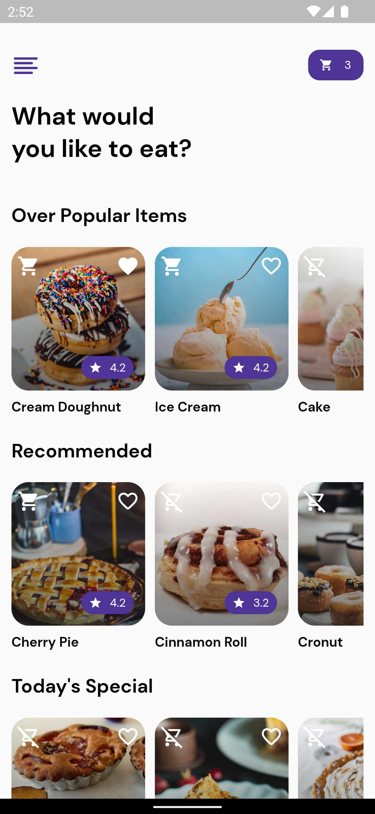
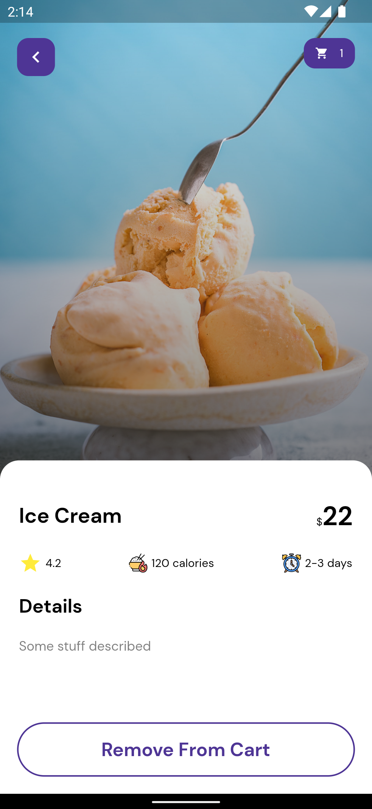
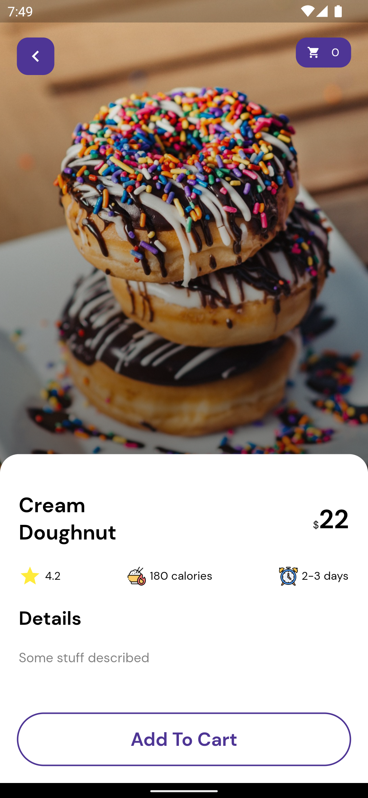

# 🏡 Online Shop App

This flutter app was built using BloC and orchestrated following the guidelines of the clean code architecture.

## Summary

The app is a simple flutter app that show list of products, which you can add to your cart and also choose favorites

## 💻 Requirements
* Any Operating System (ie. MacOS X, Linux, Windows)
* Any IDE with Flutter SDK installed (ie. IntelliJ, Android Studio, VSCode etc)
* A little knowledge of Dart and Flutter

## How to Use

**Step 1:**

Download or clone this repo by using the link below:

```
https://github.com/Marcusjnr/online_shop_app
```

**Step 2:**

Go to project root and execute the following command in console to get the required dependencies:

```
flutter pub get 
```


## ✨ Features
- [x] View Products.
- [x] Add To Cart.
- [x] Favorites.
- [x] View Cart
- [X] Dependency Injection (Get It)
- [X] Bloc (State Management)

### Libraries & Tools Used
* [Flutter BloC](https://pub.dev/packages/flutter_bloc) (State Management)
* [Get it](https://pub.dev/packages/get_it)

## 📸 ScreenShots
|||
|||

### Folder Structure
Here is the core folder structure which flutter provides.

```
flutter-app/
|- android
|- build
|- ios
|- lib
|- test
```

Here is the folder structure we have been using in this project

```
lib/
|- app/
|- core/
|- main.dart
```


## 🤓 Author(s)
**Okocha Ebube**

## 📖 References

##Icons FlatIcon
* [Calories icons created by Freepik - Flaticon](https://www.flaticon.com/free-icons/calories)
* [Clock icons created by justicon - Flaticon](https://www.flaticon.com/free-icons/clock)
* [Empty icons created by Flat Icons - Flaticon](https://www.flaticon.com/free-icons/empty)
* [Empty icons created by Flat Icons - Flaticon](https://www.flaticon.com/free-icons/empty)

##Images Unsplash
* [Dovile Ramoskaite](https://unsplash.com/@dovilerm?utm_source=unsplash&utm_medium=referral&utm_content=creditCopyText)
* [Deva Williamson](https://unsplash.com/@biglaughkitchen?utm_source=unsplash&utm_medium=referral&utm_content=creditCopyText)
* [Vicky Ng](https://unsplash.com/@vickyng?utm_source=unsplash&utm_medium=referral&utm_content=creditCopyText)
* [Didi Miam](https://unsplash.com/@dilja96?utm_source=unsplash&utm_medium=referral&utm_content=creditCopyText)
* [renee baude](https://unsplash.com/@reneetarantowskibaude?utm_source=unsplash&utm_medium=referral&utm_content=creditCopyText)
* [Marcus Wallis](https://unsplash.com/@marcus_wallis?utm_source=unsplash&utm_medium=referral&utm_content=creditCopyText)
* [Esperanza Doronila](https://unsplash.com/@edoronila?utm_source=unsplash&utm_medium=referral&utm_content=creditCopyText)
* [Hanne Hoogendam](https://unsplash.com/@dadivafoodstyling?utm_source=unsplash&utm_medium=referral&utm_content=creditCopyText)
* [Didi Miam](https://unsplash.com/@dilja96?utm_source=unsplash&utm_medium=referral&utm_content=creditCopyText)
* [Alex Lvrs](https://unsplash.com/@alexlvrs?utm_source=unsplash&utm_medium=referral&utm_content=creditCopyText)
* [Eiliv-Sonas Aceron](https://unsplash.com/@shootdelicious?utm_source=unsplash&utm_medium=referral&utm_content=creditCopyText)


## 🔖 LICENCE
[Apache-2.0]
